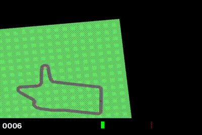

# RL Autonomous Racing Agent

A reinforcement-learning agent trained to drive autonomously around a track, using PPO (Proximal Policy Optimization) on the CarRacing environment.



## Motivation
After competing in the **AWS DeepRacer League** — training a reinforcement-learning model to race an autonomous car — I rebuilt the experience from scratch with an open, fully transparent implementation. This project also connects to my research interest in self-regulating and adaptive systems (see my [SRCA preprint](https://philpapers.org/rec/ASGSCA)).

## How it works
- **Environment:** CarRacing (Gymnasium) — the agent observes camera images of the track.
- **Algorithm:** PPO with a CNN policy, since the input is visual.
- **Frame stacking:** 4 consecutive frames are stacked so the agent can perceive motion and direction.
- **Reward:** the agent is rewarded for staying on track and progressing around the lap.

During training, average reward improved from roughly **-58 to +121**, showing the agent learning to control the car and follow the track.

The trained model weights are not included here due to file size; run `train_carracing.py` to reproduce them.

## Run it
```bash
pip install -r requirements.txt
python train_carracing.py
```

## Notes
The included model was trained for 100k steps as a proof of concept; training longer (300k–500k+) yields noticeably smoother driving. The focus of this project is a correct, well-understood RL pipeline — not a maximally-tuned agent.
